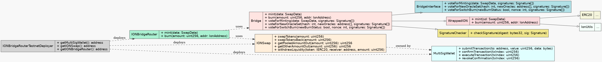

# ION Bridge Router Contract (`IONBridgeRouter.sol`)

## Introduction

The **ION Bridge Router Contract** (`IONBridgeRouter.sol`) is a smart contract designed to streamline the process of
swapping and bridging **ION** tokens. It serves as a facade for the `IONSwap` and `Bridge` contracts, providing a
unified interface for users to perform cross-chain swaps and token transfers seamlessly.

By encapsulating the interactions with both the swap and bridge functionalities, the `IONBridgeRouter` simplifies the
user experience, reducing the complexity involved in token conversions and cross-chain operations. Users can invoke the
`mint` and `burn` methods to perform swaps and bridge their tokens in a single transaction.

---

## How the Router Works

### Acting as a Facade

- **Facade Pattern**: The `IONBridgeRouter` acts as an intermediary between the user and the underlying `IONSwap` and
  `Bridge` contracts.
- **Unified Interface**: It exposes `mint` and `burn` functions, simplifying user interactions.

### **`ICE v1` to `ICE v2` Swap and Bridge Process**

1. **Swap `ICE v1` to `ICE v2`**:
    - When a user calls the `burn` method on the `IONBridgeRouter`, the contract first interacts with the `IONSwap`
      contract.
    - **Function Called**: `_swapIceV1ToV2` internally calls `swapTokens` on the `IONSwap` contract.
    - **Purpose**: Converts the user's `ICE v1` tokens to `ICE v2` tokens at a fixed exchange rate, adjusting for token
      decimals.

2. **Bridge `ICE v2` Tokens**:
    - After swapping, the `IONBridgeRouter` interacts with the `Bridge` contract via the `IIONBridge` interface.
    - **Function Called**: `burn` on the `Bridge` contract, which burns the `ICE v2` tokens and initiates a transfer to
      the ION network.
    - **Purpose**: Bridges the `ICE v2` tokens to the ION network.

### **`ICE v2` to `ICE v1` Swap and Bridge Process**

1. **Mint `ICE v2` Tokens from the ION Network**:
    - When a user initiates a transfer from the ION network to the EVM network, validators on the `Bridge` contract
      reach a consensus to mint the equivalent amount of `ICE v2` tokens.
    - **Function Called**: `mint` on the `IONBridgeRouter`, which calls `voteForMinting` on the `Bridge` contract.
    - **Purpose**: Mints `ICE v2` tokens on the EVM network, representing the tokens transferred from the ION network.

2. **Swap `ICE v2` to `ICE v1`**:
    - After receiving `ICE v2` tokens, the router swaps them for `ICE v1` tokens.
    - **Function Called**: `_swapIceV2ToV1` internally calls `swapTokensBack` on the `IONSwap` contract.
    - **Purpose**: Converts the user's `ICE v2` tokens to `ICE v1` tokens at a fixed exchange rate, adjusting for token
      decimals.

3. **Transfer `ICE v1` to the User**:
    - The swapped `ICE v1` tokens are transferred to the user's address.
    - **Purpose**: Completes the swap and provides the user with `ICE v1` tokens.

---

## Using the ION Bridge Router

### Prerequisites

- **Wallet Setup**: Ensure you have a compatible Ethereum wallet (e.g., MetaMask).
- **Token Balances**:
    - For `ICE v1` to `ICE v2`: Sufficient balance of `ICE v1` tokens.
    - For `ICE v2` to `ICE v1`: Ability to receive `ICE v1` tokens.
- **Contract Addresses**:
    - **IONBridgeRouter**: The deployed address of the `IONBridgeRouter` contract.
    - **ICE v1 Token**: Address of the `ICE v1` token contract.
    - **ICE v2 Token**: Address of the `ICE v2` token contract.

---

## Contract Functions Overview

### IONBridgeRouter Functions

#### Public Functions

- **`burn(uint256 amount, IIONBridge.IONAddress memory addr)`**

    - Swaps `ICE v1` to `ICE v2` and burns the `ICE v2` tokens via the `Bridge` contract to initiate a cross-chain
      transfer.
    - **Parameters**:
        - `amount`: Amount of `ICE v1` tokens to burn and bridge.
        - `addr`: An `IONAddress` struct containing the ION network address to receive the tokens.
    - **Process**:
        1. Calls `_swapIceV1ToV2` to swap `ICE v1` to `ICE v2` using the `IONSwap` contract.
        2. Approves the `Bridge` contract to spend the swapped `ICE v2` tokens.
        3. Calls `burn` on the `Bridge` contract to burn the `ICE v2` tokens and initiate bridging to the ION network.
    - **Purpose**: Enables users to send tokens from the EVM network to the ION network seamlessly.

- **`mint(IIONBridge.SwapData memory data, IIONBridge.Signature[] memory signatures)`**

    - Mints `ICE v2` tokens via the `Bridge` contract and swaps them for `ICE v1` tokens.
    - **Parameters**:
        - `data`: A `SwapData` struct containing the minting details (receiver address, amount, transaction details).
        - `signatures`: An array of `Signature` structs from the Bridge oracles.
    - **Process**:
        1. Validates that `data.receiver` matches `msg.sender`.
        2. Calls `voteForMinting` on the `Bridge` contract to mint `ICE v2` tokens to the user.
        3. Calls `_swapIceV2ToV1` to swap the minted `ICE v2` tokens for `ICE v1` tokens using the `IONSwap` contract.
        4. Transfers `ICE v1` tokens to the user.
    - **Purpose**: Facilitates the receipt of tokens from the ION network and converts them to `ICE v1` tokens on the
      EVM network.

#### Internal Functions

- **`_swapIceV1ToV2(uint256 amount) → uint256`**

    - Internal function to swap `ICE v1` tokens to `ICE v2` tokens using the `IONSwap` contract.
    - **Parameters**:
        - `amount`: Amount of `ICE v1` tokens to swap.
    - **Process**:
        1. Transfers `ICE v1` tokens from the user to the contract.
        2. Approves the `IONSwap` contract to spend `ICE v1` tokens.
        3. Calls `swapTokens` on the `IONSwap` contract.
    - **Returns**: Amount of `ICE v2` tokens received after the swap.

- **`_swapIceV2ToV1(uint256 iceV2Amount) → uint256`**

    - Internal function to swap `ICE v2` tokens to `ICE v1` tokens using the `IONSwap` contract.
    - **Parameters**:
        - `iceV2Amount`: Amount of `ICE v2` tokens to swap.
    - **Process**:
        1. Transfers `ICE v2` tokens from the user to the contract.
        2. Approves the `IONSwap` contract to spend `ICE v2` tokens.
        3. Calls `swapTokensBack` on the `IONSwap` contract.
    - **Returns**: Amount of `ICE v1` tokens received after the swap.

---

## Frequently Asked Questions (FAQ)

### 1. **Why use the IONBridgeRouter instead of interacting with `IONSwap` and `Bridge` separately?**

The `IONBridgeRouter` simplifies the process by combining swap and bridge operations into a single interface. It reduces
complexity and potential errors, providing a streamlined user experience.

### 2. **Do I need to approve tokens for both swaps and bridges?**

Yes, you need to approve the necessary tokens:

- **For `ICE v1` to `ICE v2` Burn**:
    - Approve the `IONBridgeRouter` contract to spend your `ICE v1` tokens before calling `burn`.
- **For `ICE v2` to `ICE v1` Mint**:
    - No additional approvals are needed as the router handles token transfers internally.

### 3. **What is the role of the `signatures` parameter in the `mint` function?**

The `signatures` parameter contains an array of signatures from the Bridge oracles. These signatures are required by the
`Bridge` contract's `voteForMinting` function to validate and approve the minting of `ICE v2` tokens on the EVM network.

### 4. **What if I provide incorrect or insufficient signatures in the `mint` function?**

If the provided signatures are incorrect, insufficient, or invalid, the `voteForMinting` function on the `Bridge`
contract will revert the transaction. Ensure that you have the correct signatures from the Bridge oracles.

### 5. **Are there fees associated with using the IONBridgeRouter?**

- **Swapping (`IONSwap`)**: No fees besides the gas fees for the transaction.
- **Bridging (`Bridge`)**: Fees may apply as defined in the `Bridge` smart contract.

### 6. **Can I use the IONBridgeRouter to swap and bridge other tokens?**

No. The `IONBridgeRouter` is specifically designed for `ICE v1` and `ICE v2` tokens.

# Architect Diagram

- **IONBridgeRouter**: Acts as the interface for users to interact with both the `IONSwap` and `Bridge` contracts.
- **IONSwap**: Handles the swapping between `ICE v1` and `ICE v2` tokens.
- **Bridge**: Manages the bridging of tokens between the EVM network and the ION network.
- **User**: Interacts with the `IONBridgeRouter` to perform swaps and bridge tokens.

---

# Quick Reference

- **Swapping `ICE v1` to `ICE v2` and Bridging to ION Network**:
    1. Approve `IONBridgeRouter` to spend your `ICE v1` tokens.
    2. Call `burn(amount, addr)` on `IONBridgeRouter`.

- **Receiving Tokens from ION Network and Swapping to `ICE v1`**:
    1. Obtain the necessary `SwapData` and signatures from the Bridge oracles.
    2. Call `mint(data, signatures)` on `IONBridgeRouter`.

---
