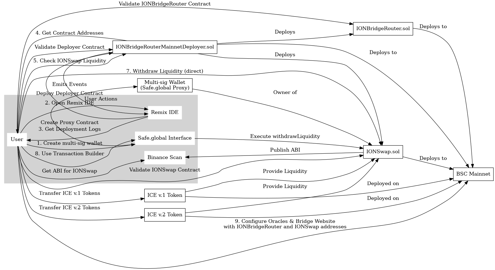

# A manual to deploy the `IONBridgeRouter` and `IONSwap` contracts to BSC Mainnet

## Steps
1. https://Safe.global multi-signature address creation
2. Deploying the `IONBridgeRouter` and `IONSwap` contracts.
3. Validating the `*Deployer*`, `IONBridgeRouter` and `IONSwap` contracts.
4. Getting the `IONBridgeRouter` and `IONSwap` contract addresses.
5. Checking the `IONSwap` liquidity.
6. Putting the `IONSwap` liquidity.
7. Withdrawing the `IONSwap` liquidity.
8. Withdrawing the `IONSwap` liquidity using https://Safe.global 
9. Configuring other components.



### 1. https://Safe.global multi-signature address creation
To manage ownership / liquidity in the `IONSwap` contract, it is necessary to create the multi-sig address. This address simply acts as the owner of the `IONSwap` contract.
Any other owner can be used as well. For example - just the usual MetaMask address. 

The `IONBridgeRouter` contract does not have the owner, so, it does not require the multi-sig.

The https://Safe.global address is the address of their `Proxy Contract`. To get one, follow these steps:
1. Register an account here after connecting with MetaMask: https://app.safe.global/new-safe/create
2. Add signers on the next step, choosing how many of them needed to vote (threshold).
3. Make a small paid transaction to create the proxy. 
4. Get the proxy address.
5. Now, this address can be used as an owner for any contracts, which will be callable through this multi-sig account.

### 2. Deploying the `IONBridgeRouter` and `IONSwap` contracts
Deploying the `IONBridgeRouter` and `IONSwap` is performed by the `deploy/IONBridgeRouter*Deployer` smart contract, where `*` is `Mainnet` / `Testnet` / `Hardhat`.
The deployer contract acts as a factory to avoid possible errors while deploying manually. It has no arguments and deploys all at a time.

Also, the deployer contract returns all necessary configuration information about all the contracts deployed.

For the `IONBridgeRouterMainnetDeployer` contract:
1. The https://Safe.global proxy address needs to be inserted into the following variable:
```solidity
    /// @notice Address of the multi-signature wallet used for contract ownership
    address constant public safeGlobalAddress = 0xae4094223718f34f581485E56C209bfa281290dc; // Safe.global proxy
```
2. The `ICE.io v.1` and `ICE.io v.2` contract addresses are also in the deployer contract.
3. The deployer contract can be flattened using:
```shell
npm run flatten:IONBridgeRouterMainnetDeployer
```
4. Now, the deployer can be deployed using https://remix.ethereum.org. This deployment is like for a trivial contract. The constructor has no arguments. Solidity version is `0.8.27`.
5. IT IS HIGHLY CONVENIENT AND DESIRED TO COPY THE ENTIRE REMIX IDE LOG INCLUDING CONTRACT EVENTS. THIS WILL BE USED FOR VALIDATING THE CONTRACTS.


### 3. Validating the `*Deployer*`, `IONBridgeRouter` and `IONSwap` contracts.
Validating the `*Deployer*` contract is trivial.

Validating the `IONBridgeRouter` and `IONSwap` contracts is harder, because these contracts have constructor arguments. To validate them:
1. Find their constructor arguments from events emitted while the `Deployer` contract was deployed (FROM LOGS FROM THE PREVIOUS STEP).
2. Encode these constructor arguments using https://abi.hashex.org/
3. Solidity version is `0.8.27`. Use the flattened file.
4. Validate in a usual way, but inserting the constructor arguments string.

### 4. Getting the `IONBridgeRouter` and `IONSwap` contract addresses.
There are 2 ways to get deployed contract addresses.

**Way #1**: From the `*Deployer*` contract logs, containing events, emitted during deployment.

**Way #2**: By querying the validated `*Deployer*`:
1. `getIONBridgeRouter` returns the router address.
2. `getIONSwap` returns the swap address.

### 5. Checking the `IONSwap` liquidity
The `*Deployer*` contract has the `liquidity` method, which returns the respective amount of `ICE v.1` and `ICE v.2` tokens available at the `IONSwap` contract, deployed by this deployer.

### 6. Putting the `IONSwap` liquidity
Putting the `IONSwap` liquidity is accomplished by transferring `ICE v.1` and `ICE v.2` to the `IONSwap` contract address.

### 7. Withdrawing the `IONSwap` liquidity
The `IONSwap` contract has the `withdrawLiquidity` owner-method. When the owner is a usual address, it can be called by the usual transaction.
When the owner is the multi-sig address, it can be called by the multi-sig wallet.

### 8. Withdrawing the `IONSwap` liquidity using https://Safe.global
https://Safe.global has the transactions builder, which can be used for calling any contracts:
1. Open the `Transactions` menu item at https://app.safe.global/.
2. Choose `New transaction`.
3. Choose `Transaction builder`.
4. Put the `IONSwap` contract address and its ABI (can be copied from Binance Scan).
5. The transaction can be simulated to get any information about possible errors while executing.

### 9. Configuring other components 
1. The `IONBridgeRouter` address is placed into the `BSC-ION Oracles` (not ION-BSC) environment variables and into the `Bridge Website` configuration.
2. The `IONSwap` address is placed into the `Bridge Website` configuration.

